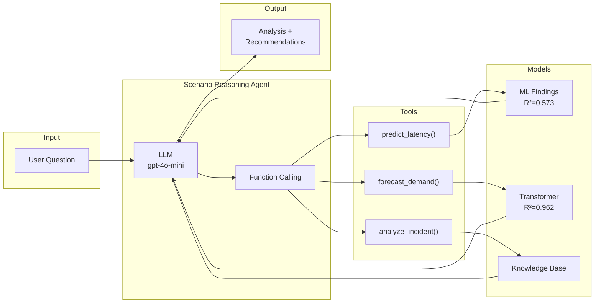

# Integrative Industry Synthesis

## GPU Infrastructure Scenario Reasoning Agent

This project implements an **LLM-powered scenario reasoning agent** that integrates trained models and patterns from four prior capstone projects into a unified analysis framework. The agent uses **OpenAI gpt-4o-mini with function calling** to analyze what-if questions about GPU cloud infrastructure operations.

GitHub repository: `https://github.com/sam-andaluri/industry-integrated-ai-systems-synthesis`

## Overview

The Scenario Reasoning Agent accepts natural language infrastructure scenarios and:

1. Uses LLM reasoning to decide which prior project tools are relevant
2. Calls tools that run **actual trained models** (XGBoost, Transformer)
3. Synthesizes model outputs into actionable recommendations
4. Reports confidence levels based on model performance metrics

## Prior Project Integration

| Project | Artifact | Integration |
|---------|----------|-------------|
| **Machine Learning Latency Predictor** | SHAP findings, correlation analysis | `predict_latency()` analytical model using XGBoost findings (R²=0.573) |
| **Deep Learning Demand Forecaster** | `transformer_forecaster.pt`, `scaler.joblib` | `forecast_demand()` runs actual Transformer model (R²=0.962) |
| **Generative AI Operations Advisor** | Advisory prompt templates | LLM synthesis of tool outputs |
| **AIOps Incident Response System** | `knowledge_base.json`, `policies.json` | `analyze_incident()` searches KB with safeguards |

## Directory Structure

```text
integrative-synthesis/
├── README.md
├── architecture_diagram.md
├── synthesis_system.ipynb
├── Reflective_Synthesis_Paper.md
├── Reflective_Synthesis_Paper.pdf
|── presentation.md
|── presentation_diagrams.md
|── presentation.html
├── requirements.txt
├── synthesis_results.json
├── machine-learning-project/          # Clone of prior project
│   └── models/
│       ├── xgboost_tuned.joblib
│       ├── scaler.joblib
│       └── feature_columns.txt
├── deep-learning-project/             # Clone of prior project
│   └── models/
│       ├── transformer_forecaster.pt
│       └── scaler.joblib
├── generative-ai-project/             # Clone of prior project
└── agentic-ai-system/                 # Clone of prior project
    └── data/
        ├── knowledge_base.json
        └── policies.json
```

## 1. Clone Prior Project Repositories

The synthesis loads actual trained models from prior projects. Clone them first:

```bash
git clone https://github.com/sam-andaluri/machine-learning-project.git
git clone https://github.com/sam-andaluri/deep-learning-project.git
git clone https://github.com/sam-andaluri/generative-ai-project.git
git clone https://github.com/sam-andaluri/agentic-ai-system.git
```

## 2. Install `uv`

Install `uv` with the standalone installer:

```bash
curl -LsSf https://astral.sh/uv/install.sh | sh
```

Or install it with Homebrew on macOS:

```bash
brew install uv
```

Confirm the installation:

```bash
uv --version
```

## 3. Prerequisites

Make sure the following tools are available on your system:

- Python 3.11 or higher
- Jupyter with `nbconvert`
- Pandoc for PDF generation
- marp-cli for Presentation generation

Quick checks:

```bash
python --version
python -m jupyter nbconvert --version
pandoc --version
marp --version
```

## 4. Create and Activate a Virtual Environment

From the project folder:

```bash
uv python install 3.11
uv venv --python 3.11 .venv
source .venv/bin/activate
```

## 5. Install Dependencies

Install the pinned dependencies from `requirements.txt`:

```bash
uv pip install -r requirements.txt
```

## 6. Setup Environment for OpenAI API

Create a `.env` file or export the environment variable:

```bash
export OPENAI_API_KEY="your-openai-api-key"
```

The notebook requires a valid OpenAI API key to run the LLM-powered reasoning agent.

## 7. Run the Notebook

Open and run `synthesis_system.ipynb` in Jupyter:

```bash
jupyter notebook synthesis_system.ipynb
```

Or using JupyterLab:

```bash
jupyter lab synthesis_system.ipynb
```

Run all cells from top to bottom (Cell > Run All).

The notebook will:
1. Load trained models from prior projects
2. Run 5 test scenarios through the reasoning agent
3. Demonstrate a failure case (gradual drift detection)
4. Save results to `synthesis_results.json`

## 8. Test Scenarios

The notebook runs these scenarios:

| # | Category | Scenario |
|---|----------|----------|
| 1 | Capacity | 2x traffic spike - latency impact? |
| 2 | Reliability | Recurring XID 63 errors (4x this week) |
| 3 | Efficiency | New LoRA adapter rollout (30% traffic) |
| 4 | Compound | Traffic spike + 2 node failures at 2PM |
| 5 | Efficiency | Low utilization (35%) but high latency |

**Failure Case**: Gradual utilization decline (60% → 45% over 1 month) - demonstrates the limitation that event-driven tools cannot detect slow drift.

## 9. Generate the Report PDF

```bash
pandoc Reflective_Synthesis_Paper.md -o Reflective_Synthesis_Paper.pdf
```

## 10. Generate presentation

```bash
marp --html presentation.md
```

## Architecture

The agent uses OpenAI function calling to let the LLM decide which tools to invoke:



See [Reasoning Agent Architecture](architecture_diagram.md) for detailed diagrams.

## References

Agrawal, A., et al. (2024). Vidur: A large-scale simulation framework for LLM inference. *MLSys '24*.

Lin, Y., et al. (2025). Understanding Diffusion Model Serving in Production. *SoCC '25*.

National Institute of Standards and Technology. (2023). *AI Risk Management Framework (AI RMF 1.0)*.

Schick, T., et al. (2023). Toolformer: Language models can teach themselves to use tools.

Yao, S., et al. (2023). ReAct: Synergizing reasoning and acting in language models. *ICLR*.
