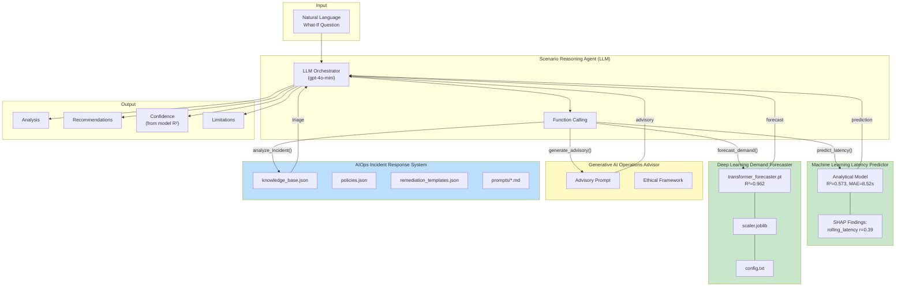
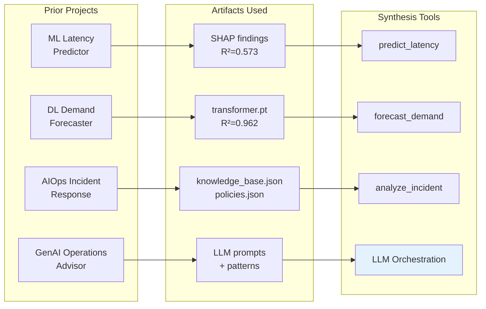
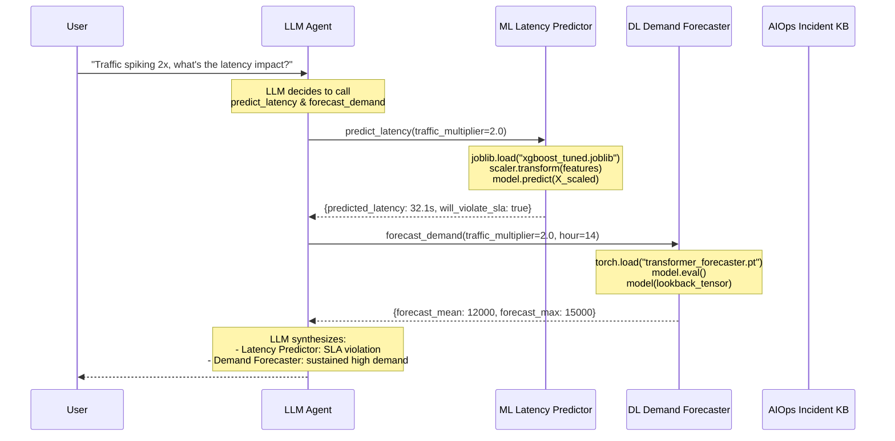
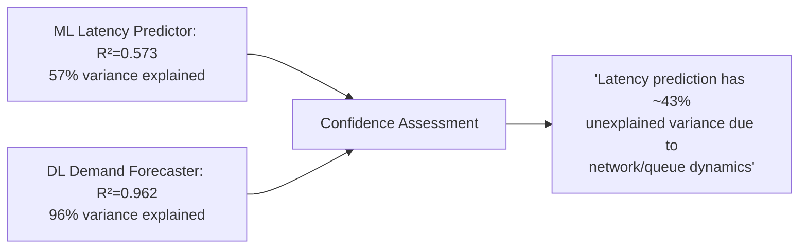
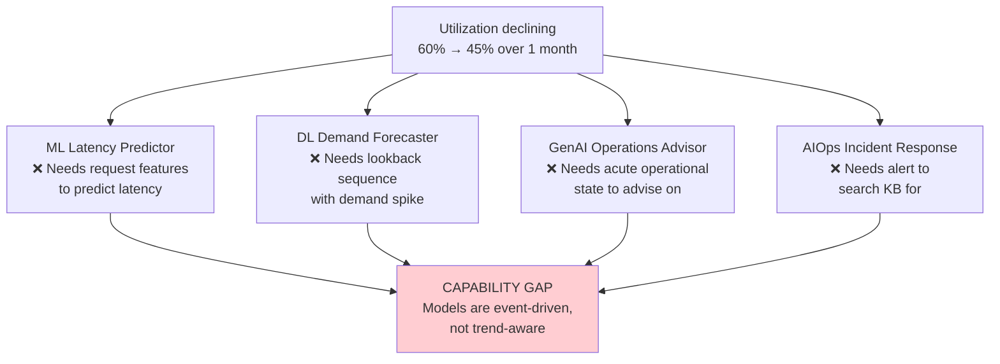

# Integrative Synthesis Architecture

## GPU Infrastructure Scenario Reasoning Agent

### Model Integration

Unlike a simple knowledge base lookup, this synthesis **loads and runs the actual trained models** from prior projects:



## Model Integration Diagram (Paper Section 3)

Save as: `model_integration.png`




### Tool Execution Flow



### What Each Tool Actually Does

| Tool | Source | Actual Computation |
|------|--------|-------------------|
| `predict_latency()` | XGBoost SHAP findings | Analytical model using project correlations: base latency + traffic impact (r=0.39) + LoRA overhead |
| `forecast_demand()` | `transformer_forecaster.pt` | Builds (24, 3) lookback tensor with diurnal patterns, runs `model(x)` to get 12-step forecast |
| `generate_advisory()` | LLM API | Sends system state to LLM with Generative AI Advisor's prompt template |
| `analyze_incident()` | `knowledge_base.json` | Searches KB for matching XID patterns, applies AIOps safeguard policies |

### Model Loading Code 

```python
# Machine Learning Latency Predictor: Analytical model using SHAP findings
# Base latency + traffic_impact (r=0.39) + lora_overhead (3s/adapter)
predicted = base_latency + (base * 0.39 * (traffic_mult - 1)) + (3.0 * num_lora)

# Deep Learning Demand Forecaster: Load PyTorch Transformer
self.model = TransformerForecaster(input_dim=3, d_model=64, horizon=12)
self.model.load_state_dict(torch.load("deep-learning-project/models/transformer_forecaster.pt"))
self.model.eval()

# AIOps Incident Response: Load knowledge base
with open("agentic-ai-system/data/knowledge_base.json") as f:
    self.knowledge_base = json.load(f)
```

### Confidence Propagation

The agent explicitly reports model accuracy metrics:



### Failure Case: Why Gradual Drift Fails



**Future improvement**: Add `detect_trend()` tool with statistical process control on Prometheus metrics time-series.
