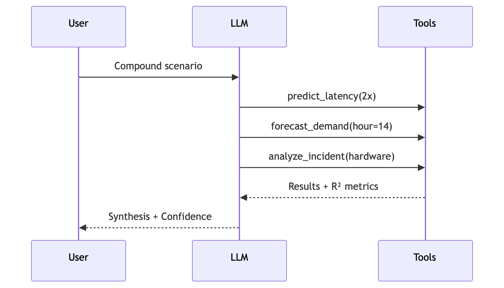
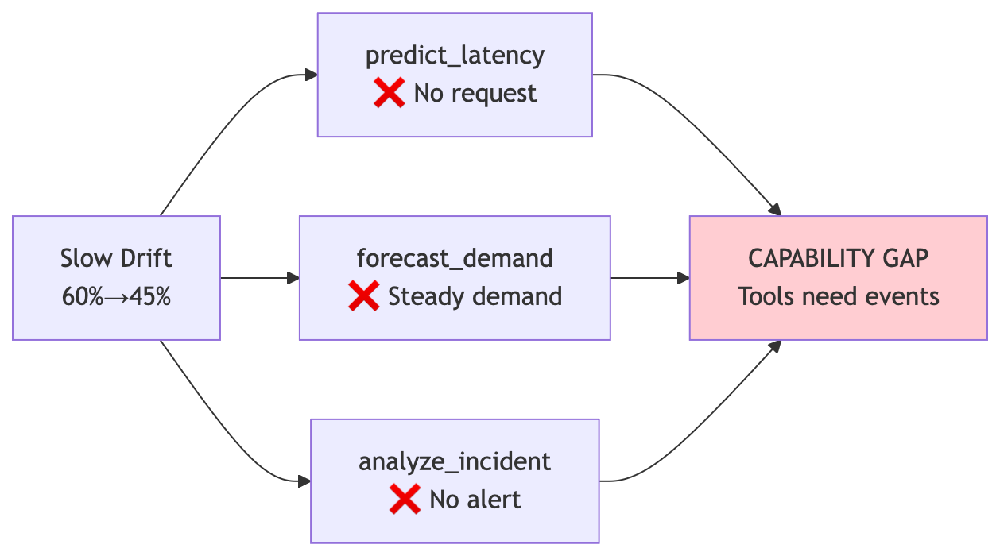

<!--
MERMAID SETUP:
Option 1: Use marp-cli with mermaid support
  npx @marp-team/marp-cli@latest --html -o presentation.pdf presentation.md

Option 2: Pre-render Mermaid diagrams at https://mermaid.live
  Then replace mermaid code blocks with 

Option 3: Use VS Code with "Marp for VS Code" + "Markdown Preview Mermaid Support" extensions
-->

# GPU Infrastructure Scenario Reasoning Agent

## Integrative Industry Synthesis

**Sambasiva Andaluri**
Udacity/Woolf MS in AI Capstone Project | May 2026

---

# The Problem

## GPU Infrastructure is Complex

- **Expensive hardware** often sits at <50% utilization
- **Multiple monitoring systems** with separate dashboards
- **Compound incidents** require mental synthesis
  - Traffic spike + hardware failure = ?

## Current State

> Operators must manually piece together alerts from different systems during high-pressure incidents

---

# The Solution

## Scenario Reasoning Agent

An LLM-powered assistant that:

1. Accepts **natural language** what-if questions
2. **Decides which tools** are relevant (no hardcoded rules)
3. **Runs actual models** and synthesizes outputs
4. Reports **confidence levels** and limitations

### Example Query
> "Traffic is spiking AND we lost 2 GPU nodes. It's 2PM. What do we do?"

---

# Architecture

<!-- Generate from diagrams.md using mermaid.live -->


**Flow:** User Question → LLM decides tools → Tools return results → LLM synthesizes → Response with confidence

---

# Prior Project Integration

**4 projects integrated → 3 callable tools + 1 orchestration pattern**

| Project | Integration | Tool |
|---------|-------------|------|
| **ML Latency Predictor** | SHAP findings (r=0.39) | `predict_latency()` |
| **DL Demand Forecaster** | Actual PyTorch model | `forecast_demand()` |
| **AIOps Incident Response** | Knowledge base + safeguards | `analyze_incident()` |
| **GenAI Advisor** | LLM orchestration pattern | *(embedded in agent)* |

---

# Live Demo

**Query:**
> "Traffic is spiking AND we just lost 2 GPU nodes to hardware failures. It's 2PM on a Tuesday. What do we do?"

**Key points to observe:**
1. LLM calls **all 3 tools** (not hardcoded - it decides)
2. Parameters extracted: `traffic_multiplier=2.0`, `hour=14`, `alert_type=hardware failure`
3. Each tool returns **R² confidence** metrics
4. Final response **synthesizes** all outputs with recommendations

---

# Live Demo - Sequence

<!-- Generate from diagrams.md -->


---

# Tool Outputs Example

### predict_latency()
```json
{
  "predicted_latency_seconds": 34.75,
  "will_violate_sla": true,
  "model_R2": 0.573,
  "insight": "At 2x traffic, latency increases by ~9.8s"
}
```

### forecast_demand()
```json
{
  "forecast_mean": 10200,
  "model_R2": 0.962,
  "temporal_insight": "Hour 14 is peak (high demand expected)"
}
```

---

# Failure Case

## What the System CAN'T Do

**Scenario:** "GPU utilization slowly dropped from 60% to 45% over a month. No alerts."

| Tool | What It Needs | Why It Can't Help |
|------|---------------|-------------------|
| predict_latency | A request to analyze | No specific request here |
| forecast_demand | A traffic spike | Demand is steady/declining |
| analyze_incident | An alert to triage | No alert fired |

**The Gap:** Tools react to events. They can't detect gradual changes over time.

---

# Failure Case - Diagram

<!-- Generate from diagrams.md -->



**Future Fix:** Add `detect_trend()` for time-series anomaly detection.

---

# Ethical Considerations

## 1. Automation Bias
- LLMs sound confident even when wrong
- **Mitigation**: Report R²/MAE/Confidence scores in every response

## 2. Accountability Gap
- Multiple tools contribute - who's responsible?
- **Mitigation**: Full reasoning chain for auditability

## 3. Human Oversight
- High-severity actions (P1/P2) require approval
- **Mitigation**: System is advisory, not autonomous

---

# Tradeoffs

| Decision | Tradeoff |
|----------|----------|
| **LLM-based planning** | Flexibility vs. determinism |
| **Mixed model loading** | Pragmatism vs. purity |
| **Transparency** | Auditability vs. conciseness |
| **Tool composition** | Modularity vs. integration depth |

---

# Key Metrics

| Component | Metric | Confidence |
|-----------|--------|------------|
| ML Latency Predictor | R²=0.573, MAE=8.52s | Moderate |
| DL Demand Forecaster | R²=0.962, MAE=1050 | High |
| AIOps KB | 11 issues indexed | N/A |

### Model Loading Status
- DL Forecaster: **Actual PyTorch model**
- ML Predictor: **Analytical** (XGBoost version issues)
- AIOps: **Knowledge base loaded**

---

# Professional Relevance

## Direct Application
- Oracle Cloud Infrastructure - GPU cluster management
- Daily challenges: latency prediction, capacity planning, incident response

## Skills Demonstrated
- **System design**: Composing specialized tools
- **ML integration**: Model findings as callable functions
- **Responsible AI**: Confidence propagation, human oversight
- **Cross-domain synthesis**: ML + DL + GenAI + Agentic

---

# Future Improvements

1. **Trend Detection**
   - Statistical process control for gradual degradation

2. **Live Telemetry**
   - Connect to Prometheus/Grafana

3. **Feedback Loop**
   - Track outcomes to calibrate confidence

4. **XGBoost Loading**
   - Resolve version compatibility

---

# Summary

A scenario reasoning agent that integrates 4 prior projects via LLM orchestration.
LLM decides which tools to call - no if/else rules in code
Tools only react to discrete **events** (spikes, failures, alerts).
They can't detect **gradual changes** over weeks/months.
Every response includes confidence (R²), full reasoning chain, human approval for critical actions

---

# Questions?

---
### Thank You

**Sambasiva Andaluri**
Udacity/Woolf MS in AI Capstone Project | May 2026
Integrative Industry Synthesis
