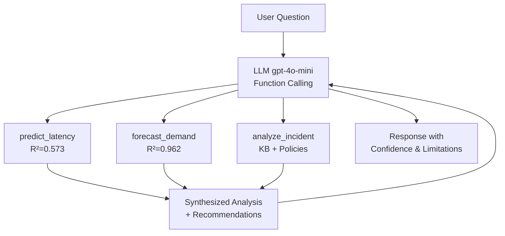
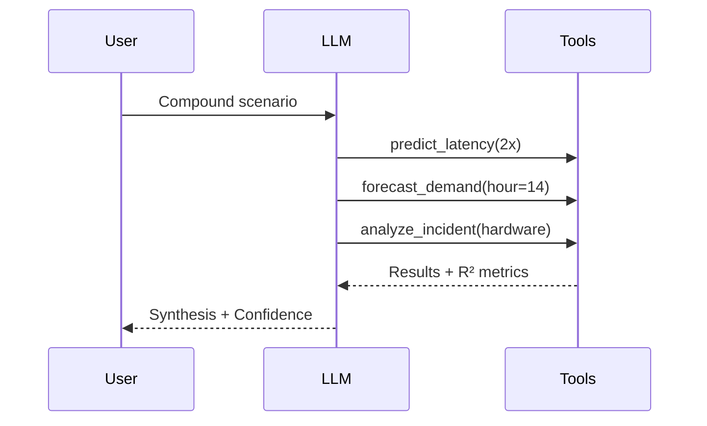
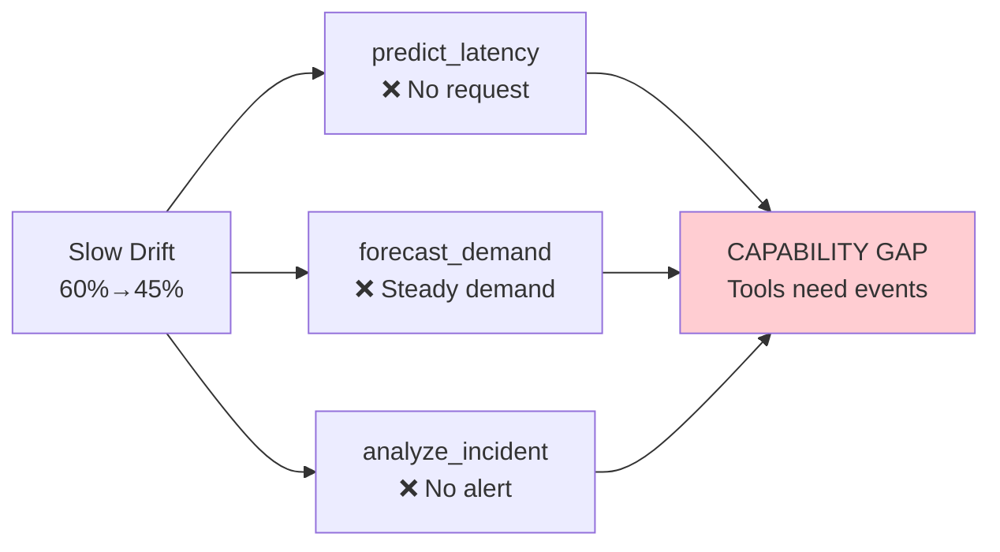
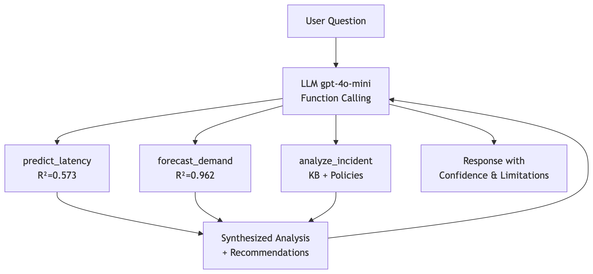

# Mermaid Diagrams for Presentation

Generate images at https://mermaid.live and save to `/images/` folder.

---

## 1. Architecture Diagram (Slide 4)

Save as: `architecture.png`



---

## 2. Demo Sequence Diagram (Slide 6)

Save as: `demo_sequence.png`



---

## 3. Failure Case Diagram (Slide 8)

Save as: `failure_case.png`



---

## Usage

1. Go to https://mermaid.live
2. Paste the mermaid code (without the ```mermaid wrapper)
3. Click "Actions" → "Download PNG"
4. Save to `images/` folder
5. In presentation.md, replace mermaid code blocks with:
   ```
   
   ```
